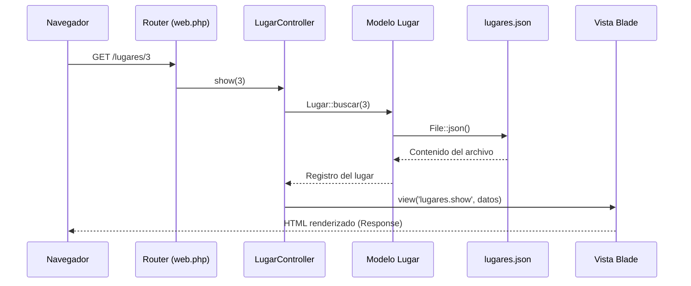
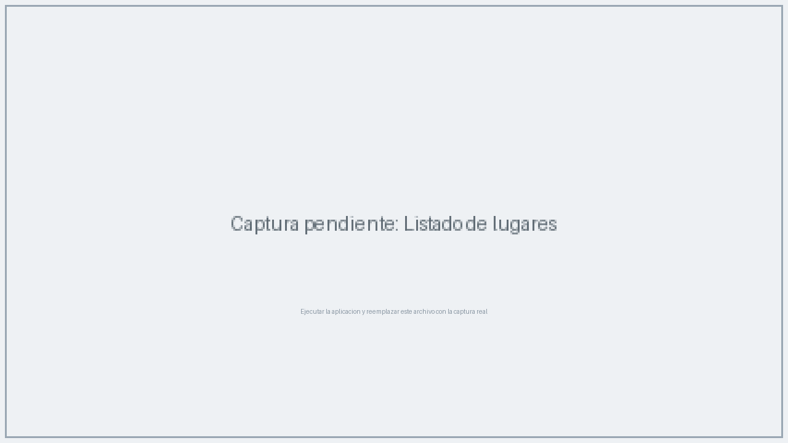
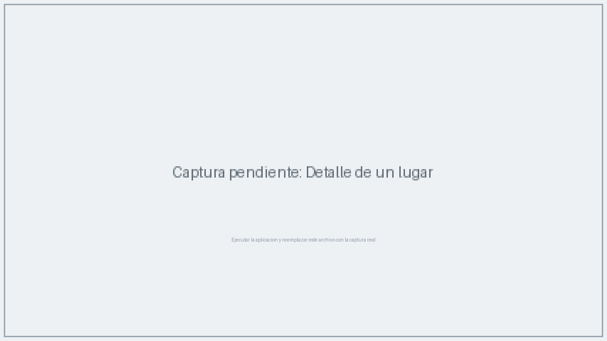
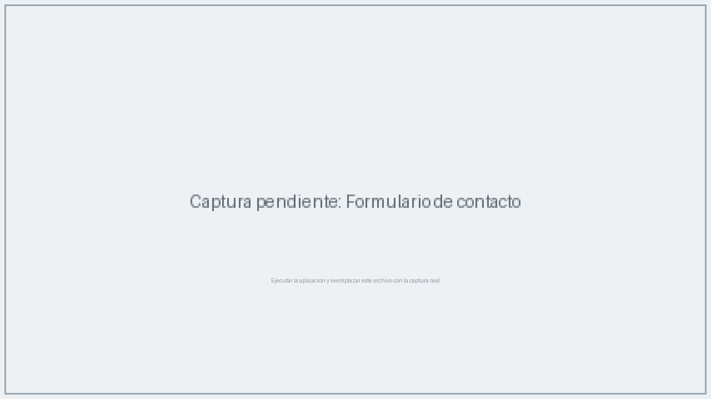
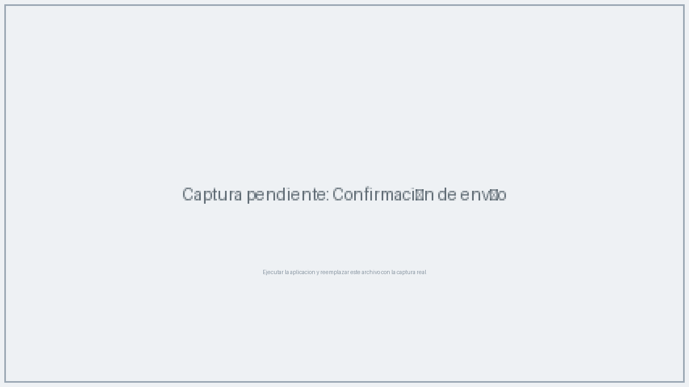

# Catálogo Turístico de El Salvador

**Implementación del patrón MVC en Laravel**

Proyecto académico elaborado por **Alejandro Campos**.

Aplicación web que demuestra el patrón arquitectónico Modelo Vista Controlador (MVC) en Laravel 12 mediante un catálogo de lugares turísticos de El Salvador. La fuente de datos es un archivo **JSON**, por lo que no se requiere base de datos: el objetivo es analizar el ciclo de vida de una petición HTTP y el flujo de la información entre las capas de la aplicación.

## Funcionalidades

- Listado de lugares turísticos leídos desde `resources/data/lugares.json`, con filtro por categoría.
- Vista de detalle de cada lugar: título, departamento, categoría, descripción, horario, ubicación, actividades y precios.
- Formulario de contacto con validación del lado del servidor; las solicitudes se guardan en `storage/app/private/contactos.json`.
- Respuesta 404 cuando se solicita un lugar que no existe en el JSON.

## Requisitos

- PHP 8.2 o superior
- Composer
- Git (para clonar el repositorio)

## Instalación y ejecución

```bash
# 1. Clonar el repositorio
git clone https://github.com/alejandrocamposd17-beep/laravel-mvc-catalogo-turistico.git
cd laravel-mvc-catalogo-turistico

# 2. Instalar dependencias de PHP
composer install

# 3. Crear el archivo de entorno y la llave de la aplicación
cp .env.example .env      # En Windows: copy .env.example .env
php artisan key:generate

# 4. Levantar el servidor de desarrollo
php artisan serve
```

Abrir en el navegador: `http://127.0.0.1:8000`

> Nota: no es necesario configurar base de datos ni ejecutar migraciones. La sesión y la caché trabajan con archivos, y los datos de la aplicación se leen del archivo JSON.


## Flujo MVC implementado

| Capa | Archivo | Responsabilidad |
|------|---------|-----------------|
| Rutas | `routes/web.php` | Recibe la URI y el método HTTP, y delega al controlador |
| Controlador | `app/Http/Controllers/LugarController.php` y `ContactoController.php` | Coordina la petición: lee parámetros, consulta el modelo y elige la vista |
| Modelo | `app/Models/Lugar.php` | Encapsula el acceso a los datos (lectura y consultas sobre el JSON) |
| Vista | `resources/views/` | Plantillas Blade que presentan la información en HTML |

### Ciclo de vida de una petición (ejemplo: `GET /lugares/3`)

1. El navegador envía la petición y `public/index.php` la recibe (punto de entrada único de la aplicación).
2. `bootstrap/app.php` arranca el framework y registra el enrutamiento y los middleware.
3. El **Router** compara la URI con las rutas definidas en `routes/web.php` y encuentra `lugares/{id}`.
4. La petición pasa por los middleware del grupo `web` (sesión, cookies y verificación CSRF).
5. Se ejecuta `LugarController@show(3)`: el **Controlador** solicita los datos al modelo.
6. El **Modelo** `Lugar` lee `resources/data/lugares.json` con `File::json()` y devuelve el registro con id 3.
7. El controlador entrega los datos a la **Vista** `lugares/show.blade.php`; Blade la compila y genera el HTML.
8. Laravel construye la **Response** y la devuelve al navegador.



En el formulario de contacto se completa el ciclo con una petición **POST**: validación de los datos en el controlador, escritura en un archivo JSON y redirección con mensaje de éxito (patrón Post-Redirect-Get).

## Rutas de la aplicación

| Método | URI | Acción | Nombre |
|--------|-----|--------|--------|
| GET | `/` | Redirige al listado | |
| GET | `/lugares` | `LugarController@index` | `lugares.index` |
| GET | `/lugares/{id}` | `LugarController@show` | `lugares.show` |
| GET | `/contacto` | `ContactoController@create` | `contacto.create` |
| POST | `/contacto` | `ContactoController@store` | `contacto.store` |

## Datos de prueba (JSON)

- `resources/data/lugares.json`: 10 lugares turísticos reales de El Salvador con título, departamento, categoría, descripción, horario, ubicación, actividades, precios de referencia e imagen.
- `storage/app/private/contactos.json`: se genera automáticamente al enviar el formulario de contacto (no se versiona en Git).

## Estructura relevante del proyecto

```text
app/
├── Http/Controllers/
│   ├── LugarController.php       # Listado y detalle de lugares
│   └── ContactoController.php    # Formulario de contacto
└── Models/
    └── Lugar.php                 # Acceso a los datos JSON
resources/
├── data/
│   └── lugares.json              # Fuente de datos de la aplicación
└── views/
    ├── layouts/app.blade.php     # Plantilla base
    ├── lugares/index.blade.php   # Listado
    ├── lugares/show.blade.php    # Detalle
    └── contacto/create.blade.php # Formulario de contacto
routes/web.php                    # Definición de rutas
public/img/lugares/               # Imágenes de los destinos
```

## Capturas de pantalla

<!-- TODO (Alejandro): ejecutar el proyecto, tomar las capturas y reemplazar los archivos de docs/capturas/ conservando los mismos nombres. Luego borrar este comentario. -->

### Listado de lugares


### Detalle de un lugar


### Formulario de contacto


### Confirmación de envío


## Autor

**Alejandro Campos**
